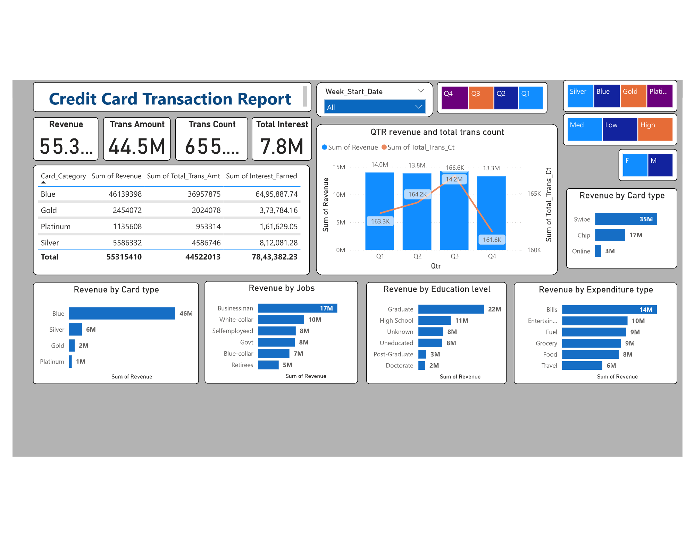
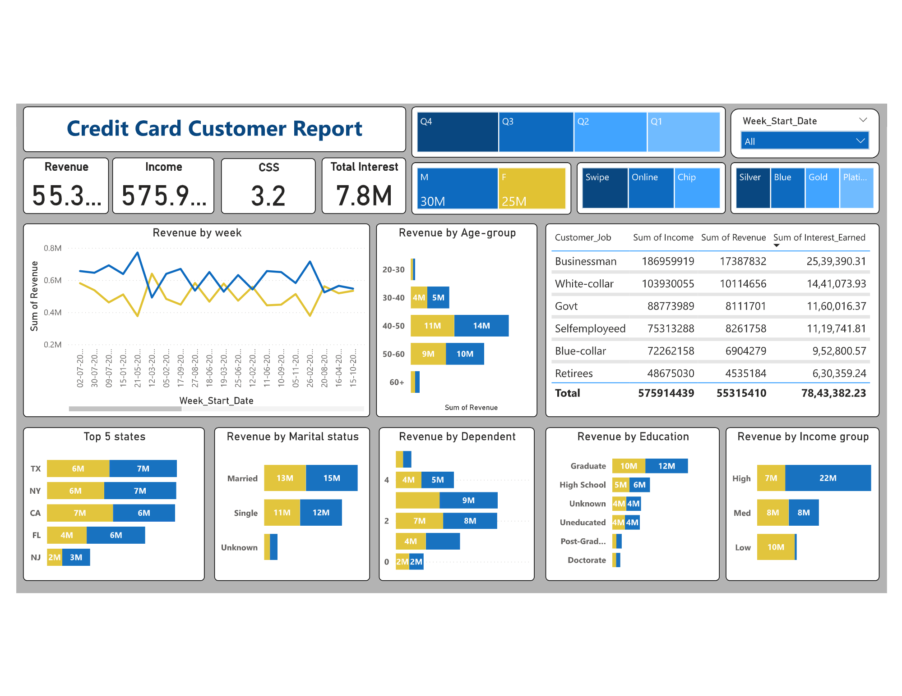

# 💳 Credit Card Insights Dashboard

A Power BI dashboard that analyzes credit card transaction patterns, revenue contributions, and customer behavior based on job, education level, and expenditure type.

---

## 📊 Dashboard Preview

---

## 📁 Dataset Details

The dataset includes:
- **customer.csv** – Customer demographics
- **cc_add.csv** – Address details
- **credit_card.csv** – Card issuance data
- **credit_card_report.pbit** – Power BI file (fully interactive)
- **credit_card_report.pdf** – Exported static report
- **SQL Query File** – Query to extract meaningful aggregates from raw data

---

## 📌 Key Visuals & KPIs

| Metric | Value |
|--------|-------|
| 💰 Revenue | ₹55.3M |
| 💳 Total Transactions | 655K |
| 📈 Interest Earned | ₹7.8M |
| 📊 Card Type Analysis | Blue, Silver, Gold, Platinum |
| 🧠 Filters | Card Type, Credit Score, Gender, Quarter |

---

## 💡 Features Implemented

- Quarter-wise revenue & transaction tracking
- Revenue segmentation by:
  - Card Type
  - Job type
  - Education level
  - Expenditure type
- Advanced slicers and filters for drill-down insights

---

## 🧱 Tools Used

- **Power BI Desktop**
- **MS SQL Server (for data querying)**
- **Excel/CSV for data sources**
- **GitHub** for version control

---

## 🚀 How to Use

1. Clone this repo or download files.
2. Open `credit_card_report.pbit` in Power BI Desktop.
3. Connect the data (if required) or refresh.
4. Explore using slicers and filters!

---

## 📌 Note

This dashboard is created for educational purposes and based on fictional or anonymized data.

---

## 🧑‍💻 Author

**Anany Lohia**  
📧 ananyatworkk@gmail.com  
🌐 [LinkedIn](https://www.linkedin.com/in/ananyakrlohia/)

---

⭐ *If you like this project, give it a star!*
